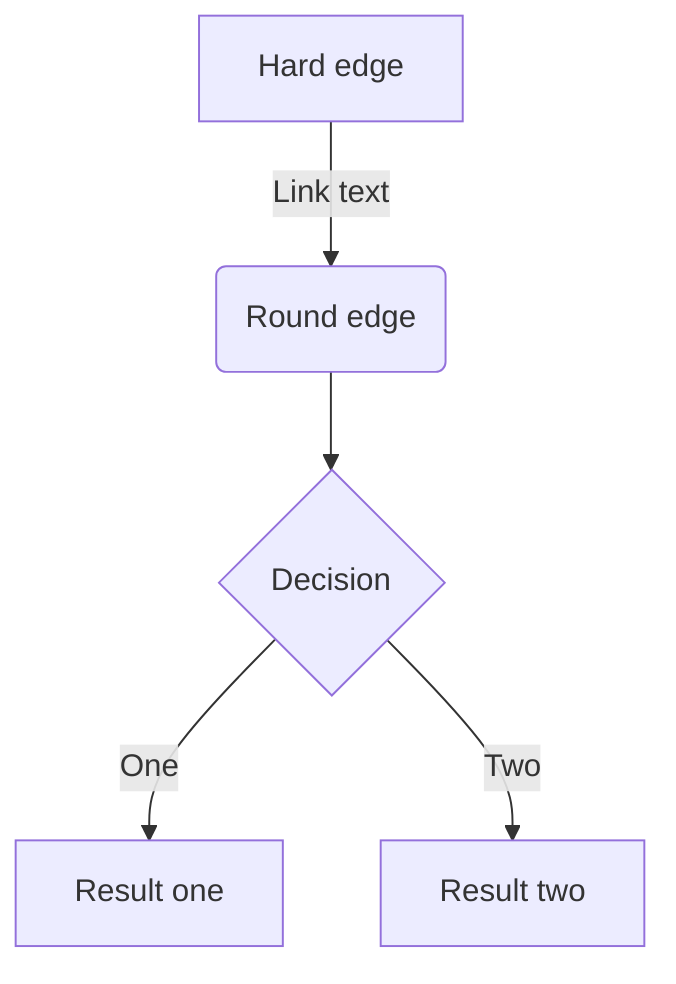

:::details はじめに
はじめまして．Zenn を始めました．
来年 4 月から未経験でソフトウェアエンジニアとして働きます．
転職に向けて勉強を進めていましたが，アウトプットをしながらの方が効率が高いと考え，今後学習したことなどを記録していこうと思います．
Zenn 独自の記法が必要なところもありますが．そもそも Markdown 記法が初めてなのでまずは自身の備忘録として記事に残したいと思います．
:::

# 【テキストの表記】

## 見出し

```python:書き方
# これはH1タグです
## これはH2タグです
#### これはH4タグで
```

## リスト

```python:書き方
- Hello!
- Hola!
  - Bonjour!
  * Hi!
```

#### 結果

- Hello!
- Hola!
  - Bonjour!
  * Hi!
    リストのアイテムには`*`もしくは`-`を使います．

## 番号付きリスト

```python:書き方
1. First
2. Second
```

#### 結果

1. First
2. Second

# 【インラインスタイル】

## 強調・強勢

```python:書き方
_ か * で囲むとHTMLのemタグになります。Zennでは *italic type* になります。
__ か ** で囲むとHTMLのstrongタグになります。Zennでは **太字** になります。
```

#### 結果

\_ か * で囲むと HTML の em タグになります。Zenn では *italic type\* になります。
\_\_ か ** で囲むと HTML の strong タグになります。Zenn では **太字\*\* になります。

## 打ち消し線

```python:書き方
打ち消し線を使うには ~~ で囲みます。 ~~打ち消し~~
```

#### 結果

打ち消し線を使うには ~~ で囲みます。 ~~打ち消し~~

## インラインでコードを挿入する

```python:書き方
インラインで`code`を挿入する
```

#### 結果

インラインで`code`を挿入する

## インラインのコメント

自分用のメモをしたいときは，HTML のコメント記法を使用できる．

```python:書き方
<!-- TODO: ○○について追記する -->
```

この形式は複数行のコメントには対応していない．
また，公開ページ上では表示されない．

# 【Zenn 独自の記法】

## アコーディオン（トグル）

```python:書き方
:::details タイトル
表示したい内容
:::
```

#### 結果

:::details タイトル
表示したい内容
:::

## メッセージ

```python:書き方
:::message
メッセージをここに
:::
```

#### 結果

:::message
メッセージをここに
:::

```python:書き方
:::message alert
警告メッセージをここに
:::
```

#### 結果

:::message alert
警告メッセージをここに
:::

## 要素をネストさせるには

外側の要素の開始/終了に`:`を追加する．

```python:書き方
::::details タイトル
:::message
ネストされた要素
:::
::::
```

#### 結果

::::details タイトル
:::message
ネストされた要素
:::
::::

# 【テキストや画像を挿入する】

## テキストリンク

```python:書き方
[アンカーテキスト](リンクのURL)
```

#### 結果

[Zenn の Markdown 記法一覧](https://zenn.dev/zenn/articles/markdown-guide)
`Ctrl + k`のショートカットでも挿入可能

## 画像

```python:書き方

```

#### 結果


## 画像の横幅を指定する

画像の表示が多きすぎる場合は，URL の後に半角スペースを空けて`=○○×`と記述すると，画像の幅を px 単位で指定できる．

```python:書き方

```

#### 結果


## キャプションをつける

画像のすぐ下の行に`*`で挟んだテキストを配置すると，キャプションのような見た目で表示される

```python:書き方

*キャプション*
```

#### 結果


_caption_

## 画像にリンクを貼る

以下のようにすることで画像に対してリンクを貼ることもできる．

```python:書き方
[](リンクのURL)
```

#### 結果

[](https://zenn.dev/zenn/articles/markdown-guide)
\*↑ 画像をクリックすると別 URL へ移動

## テーブル

```python:書き方
| Head | Head | Head |
| ---- | ---- | ---- |
| Text | Text | Text |
| Text | Text | Text |
```

#### 結果

| Head | Head | Head |
| ---- | ---- | ---- |
| Text | Text | Text |
| Text | Text | Text |

# 【コードを挿入する】

## コードブロック

コードは「```」で挟むことでブロックとして挿入可能．以下のように言語を指定するとコードへ装飾（シンタックスハイライト）が適用される．

> ````
> ```言語名
>
> ```
> ````

## ファイル名を表示する

`言語名:ファイル名`と`:`区切りで記載することで，ファイル名がコードブロックの上部に表示されるようになる．

```python:test.py
print('Hello World')
```

## diff のシンタックスハイライト

`diff`とゲンゴン尾ハイライトを同時に適用できる．
以下のように`diff`と`言語名`を半角スペース区切りで指定する．同時にファイル名を指定することも可能．
なお，`diff`の使用時には，先頭に`+`，`-`，`半角スペース`のいずれかが入っていない行はハイライトされない．

> ````
> ```diff python:ファイル名
>
> ```
> ````

#### 結果

```diff python:test.py
+    print('Hello')
-    print('Good bye')
```

# 【数式を挿入する】

Zenn では**KaTeX**による数式表示に対応している．

[KaTeX がサポートする記法の一覧 →](https://katex.org/docs/support_table.html)

## 数式のブロックを挿入

`$$`で記述を挟むことで，数式のブロックが挿入される．

```python:書き方
$$
e^{i\theta} = \cos\theta + i\sin\theta
$$
```

#### 結果

$$
e^{i\theta} = \cos\theta + i\sin\theta
$$

:::message
`$$`の前後は空の行でないと正しく埋め込まれないことがある．
:::

## インラインで数式を挿入

`$a\ne0$`というように`$`ひとつで挟むことで，インラインで数式を含めることができる．

# 引用

```python:書き方
> 引用文
> 引用文
```

#### 結果

> 引用文
> 引用文

# 注釈

注釈を指定するとページ下部にその内容が表示される．

```python:書き方
脚注の例[^1]です。インライン^[脚注の内容その2]で書くこともできます。

[^1]: 脚注の内容その1
```

#### 結果

脚注の例[^1]です。インライン^[脚注の内容その 2]で書くこともできます。

[^1]: 脚注の内容その 1

# 区切り線

```python:書き方
-----
```

#### 結果

---

# 【ダイアグラム】

````python:書き方

````

#### 結果


他にもシーケンス図やクラス図が表示できる．文法は mermaid.js に従っているため，どのように書けば良いかは[公式サイトの文法](https://mermaid.js.org/syntax/flowchart.html)を参照する．
:::message
mermaid.js 側で破壊的変更が行われた場合、表示が変更されたり、適切に表示されなくなる可能性があります。
:::

:::details 最後に
Markdown 記法を学べました．
まだまだ曖昧なところも多いですし，今回は記載しなかった部分もありあります．ですが自分のチートシートを作成することができたので，今後忘れてしまったところは都度立ち返って調べながら執筆していければと思います．
本記事に関わらず，これから自分の成長とともに書いた記事が広がり，同じように未経験からエンジニアになる方に少しでもお役にたてると嬉しいです．
最後まで読んで頂きありがとうございます！
:::
